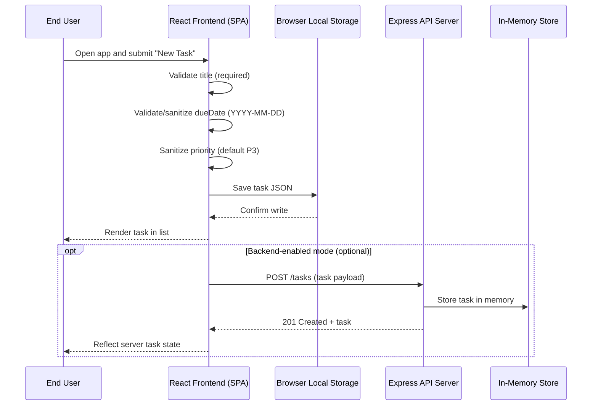

# Cloud Architecture Overview

This document provides a simple system context diagram for the monorepo: a React frontend and an Express API with an in-memory store.

## System Context Diagram

```mermaid
flowchart TD
    U[End User] --> B[React Frontend (Browser SPA)]
    B -->|HTTP/JSON| API[Express API Server]
    API --> MEM[(In-Memory Store)]

    %% Client-side local persistence (MVP)
    B --> LS[(Browser Local Storage)]

    %% Optional external integrations (none in scope)
    classDef outOfScope fill:#eee,stroke:#bbb,color:#666
    EXT[External Services]:::outOfScope
```

## Notes
- React frontend runs in the browser as a single-page application.
- Express API handles HTTP requests; current persistence is an in-memory store (no external DB).
- MVP keeps client-side data in browser Local Storage; backend remains stateless across restarts.
- No external services, notifications, or multi-user features are in scope.

---

## Sequence: Creating a TODO


